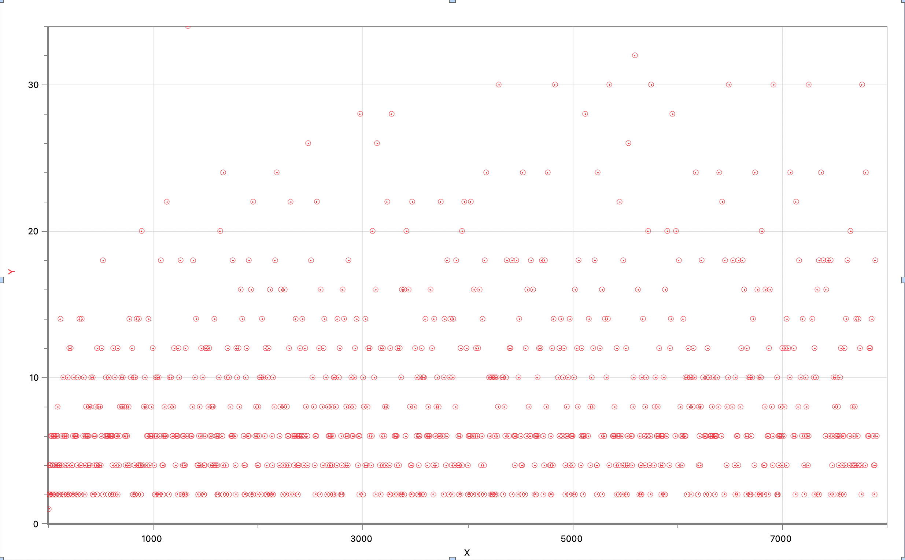
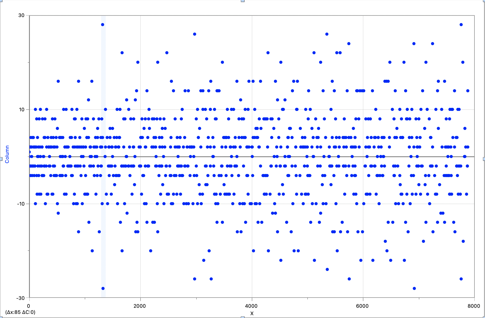

# An exploration of Prime numbers in GO

[](https://goreportcard.com/report/github.com/tsamantanis/prime-patterns)


This project aims to find patterns in the sequence of mathematically prime numbers

## Usage

Clone this repository, and make sure you have Go installed

To download project dependencies use
```
go mod download
```

To run app and save the output to a file use
```
go run main.go > data.csv
```

Data will appear in rows in `csv` format.

## Exploration

After reading the exported data found in `data.csv` it was clear that there exist repeating values in the rate of change of the prime number sequence. It is important to note that this exploration only used the first 1000 prime numbers as the initial data set. Below is an image of the 'first' rate of change - Sequence A - chart created:

> Sequence A


By following the same 'hunch' it seems rather obvious that the rate of change of Sequence A - Sequence B, would also appear in a pattern. For that reason the data exploration was repeated this time adding another data set containing Sequence B in the exported data. When graphically recreated using Logger Pro, Sequence B produced the following outcome: 

> Sequence B


Now it may be unclear on a first glance but in reality Sequence B values are oscillating between positive and negative in a `completely` symmetrical manner. This indicates that recurrence relations may apply. 

From personal experience I hypothesize that the relation of Sequence B is periodic and that we may be able to use complex numbers to solve the equation, as periodical solutions can be found in the roots of unity if no restrictions in the value of k apply.

I will be attempting to further explore this number set to hopefully find how often the relation values are repeated and create an equation for calculating a value of Sequence B, `x`, using its position in the sequence, `k`.